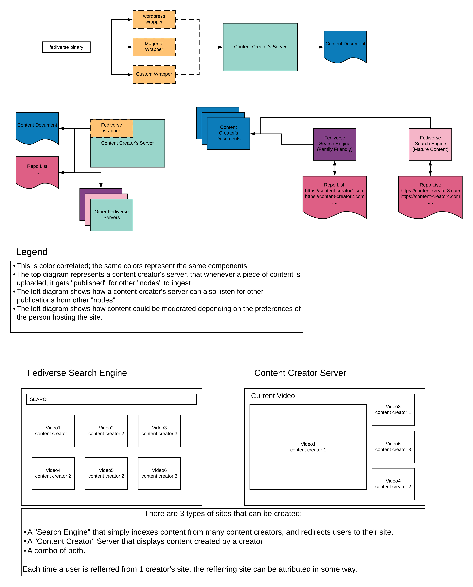
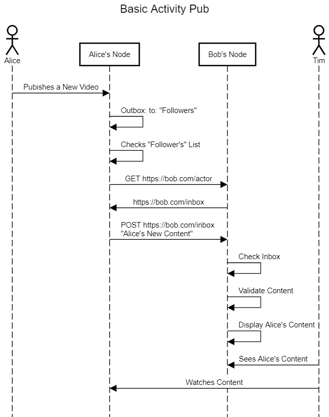

# nodefed

This repo is based off of the [app tutorial for go-fed](https://go-fed.org/activitypub-tutorial).

It's also inspired off of the core discussions I've had with Ian Crossland and the "Node Federation" project.

### General Overview:

Using the code here, you will be able to wrap it in Wordpress, Magento, or any other integration to then have the ability to display content from other Activity Pub Compatible Sites.

The diagram above illustrates the basic ideas and ways it can be used. For example, I could be a content creator that wants their personal, decentralized site to have a look and feel of youtube in that it can display other content creators content.

#### Activity Pub Sequence Diagram:

